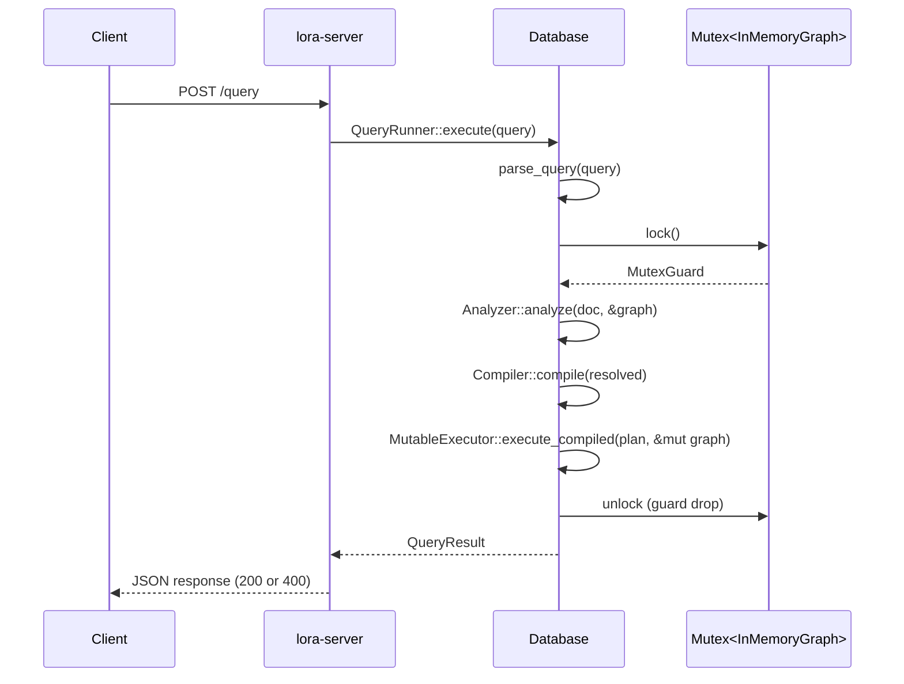

# Data Flow

## Query execution pipeline

Every Cypher query passes through five stages:

```
HTTP Request
    |
    v
1. PARSE         lora-parser     text -> Document (AST)
    |
    v
2. ANALYZE       lora-analyzer   Document -> ResolvedQuery
    |                              (validates against live graph state)
    v
3. COMPILE       lora-compiler   ResolvedQuery -> LogicalPlan -> PhysicalPlan
    |                              (includes optimizer pass)
    v
4. EXECUTE       lora-executor     PhysicalPlan -> Vec<Row>
    |                              (reads/writes InMemoryGraph)
    v
5. PROJECT       lora-executor     Vec<Row> -> QueryResult (JSON-serializable)
    |
    v
HTTP Response
```

The pipeline is orchestrated by `lora_database::Database::execute` / `execute_with_params`. The HTTP server (`lora-server`) is a thin transport on top of it.

## Detailed stage breakdown

### Stage 1: Parsing

**Input**: raw Cypher string
**Output**: `Document` (typed AST)
**Crate**: `lora-parser`

The pest PEG grammar (`cypher.pest`) defines the syntax. The parser produces a pest parse tree which is lowered into the typed AST defined in `lora-ast`. Every AST node carries a `Span { start, end }` (byte offsets) for error reporting.

**Error path**: `ParseError` with a human-readable message and span.

### Stage 2: Semantic analysis

**Input**: `Document` + `&S where S: GraphCatalog`
**Output**: `ResolvedQuery`
**Crate**: `lora-analyzer`

The analyzer walks the AST and:

- Resolves variables using a `ScopeStack` (lexical scoping)
- Assigns `VarId` identifiers to each variable binding
- Validates node labels against the live graph for `MATCH` (accepts any label in `CREATE` / `MERGE`)
- Validates relationship types the same way
- Validates property access against known property keys
- Detects duplicate variables, duplicate map keys, duplicate projection aliases
- Validates relationship range bounds (`*min..max`)
- Rejects aggregation in `WHERE`
- Rejects `CALL` (standalone and in-query) with `SemanticError::UnsupportedFeature`
- Checks UNION branches have matching column counts and names
- Checks function names and arities against the executor's dispatch table

**Error path**: `SemanticError` covers unknown variables / labels / types / properties / functions, duplicates, arity errors, unsupported features.

### Stage 3: Compilation

**Input**: `ResolvedQuery`
**Output**: `CompiledQuery { logical: LogicalPlan, physical: PhysicalPlan }`
**Crate**: `lora-compiler`

#### Logical planning

The `Planner` converts resolved clauses into a plan graph represented as `Vec<LogicalOp>` with index-based references:

| Resolved clause | Logical operator(s) |
|-----------------|---------------------|
| `MATCH` pattern | `NodeScan` / `NodeByLabelScan` + `Expand` + `Filter` (+ `PathBuild` if path bound) |
| `OPTIONAL MATCH` | `OptionalMatch` wrapping a subplan |
| `WHERE` | `Filter` |
| `RETURN` | `Projection` (+ `Sort`, `Limit`) |
| `WITH` | `Projection` (+ `Filter`, `Sort`, `Limit`) |
| `CREATE` | `Create` |
| `MERGE` | `Merge` |
| `DELETE` / `DETACH DELETE` | `Delete` |
| `SET` | `Set` |
| `REMOVE` | `Remove` |
| `UNWIND` | `Unwind` |
| `UNION` / `UNION ALL` | two subplans combined with `Projection` + deduplication |

Inline property maps (for example `(n:User {id: 1})`) are converted into `Filter` operators with equality predicates during pattern planning.

#### Optimization

Current rules:

- **Filter push-down**: move `Filter` below `Projection` when safe (not `DISTINCT`, not star projection)
- Additional rule slots exist (`remove_redundant_limit`) as placeholders

#### Physical lowering

Maps logical operators to physical operators with minor specialization:

- `NodeScan` with a label becomes `NodeByLabelScan`
- `Aggregation` becomes `HashAggregation`
- `PathBuild` carries a `shortest_path_all: Option<bool>` flag: `None` = normal path, `Some(false)` = `shortestPath()`, `Some(true)` = `allShortestPaths()`

### Stage 4: Execution

**Input**: `PhysicalPlan` + `&mut S: GraphStorageMut`
**Output**: `Vec<Row>`
**Crate**: `lora-executor`

The executor uses a **Volcano-style pull model** — each operator is evaluated recursively from the root. The `execute_node` method dispatches on the `PhysicalOp` variant.

**Physical operators** (in `lora-compiler/src/physical.rs`):
- `Argument`, `NodeScan`, `NodeByLabelScan`, `Expand` (variable-length aware), `Filter`, `Projection`, `Unwind`, `HashAggregation`, `Sort`, `Limit`, `Create`, `Merge`, `Delete`, `Set`, `Remove`, `OptionalMatch`, `PathBuild`

Two executor structs exist:

- `Executor<S: GraphStorage>` — read-only; returns `ExecutorError::ReadOnly*` for write operators
- `MutableExecutor<S: GraphStorageMut>` — supports all operators

Expression evaluation is handled by `eval_expr` in `lora-executor/src/eval.rs`, which recurses over `ResolvedExpr` nodes and dispatches function names.

Shortest-path variants of `PathBuild` run the normal variable-length expand and then pass the results through `filter_shortest_paths`, which retains either one minimum-hop path (`shortestPath`) or every minimum-hop path (`allShortestPaths`).

### Stage 5: Result projection

**Input**: `Vec<Row>` + `ExecuteOptions { format }`
**Output**: `QueryResult`

Before projection, rows are **hydrated**: `LoraValue::Node(id)` and `LoraValue::Relationship(id)` are expanded into maps containing `{kind, id, labels, properties}` or `{kind, id, startId, endId, type, properties}` (the `startId` / `endId` JSON names come from `serde(rename)` on `HydratedRelationship`; the in-Rust `RelationshipRecord` fields are still called `src` / `dst`). `LoraValue::Path(...)` expands into a sequence of hydrated nodes and relationships.

Four output formats:

- `rows` — array of maps (variable name → value)
- `rowArrays` — `{columns, rows}` with positional arrays
- `graph` — extracted node and relationship projections (**default**)
- `combined` — columns + row arrays + graph projection combined

## Concurrency model

`Database` holds the graph in `Arc<Mutex<S>>`. Each query acquires the mutex once at the top of `execute_with_params` and holds it across analyze + compile + execute. Parsing is done before locking.

- Queries are serialized
- Write queries block reads
- No transaction isolation beyond single-query atomicity

> 🚀 **Production note** — The single-mutex model is a deliberate simplification for the in-memory core. If you're running read-heavy workloads or need concurrent transactions, the [LoraDB managed platform](https://loradb.com) uses a different concurrency strategy suitable for production traffic.



## Next steps

- Storage internals the executor reads from: [Graph Engine](graph-engine.md)
- Add support for a new Cypher construct: [Cypher Development](../internals/cypher-development.md)
- Understand performance characteristics of each stage: [Performance Notes](../performance/notes.md)
- Benchmarks for the full pipeline: [Benchmarks](../performance/benchmarks.md)
