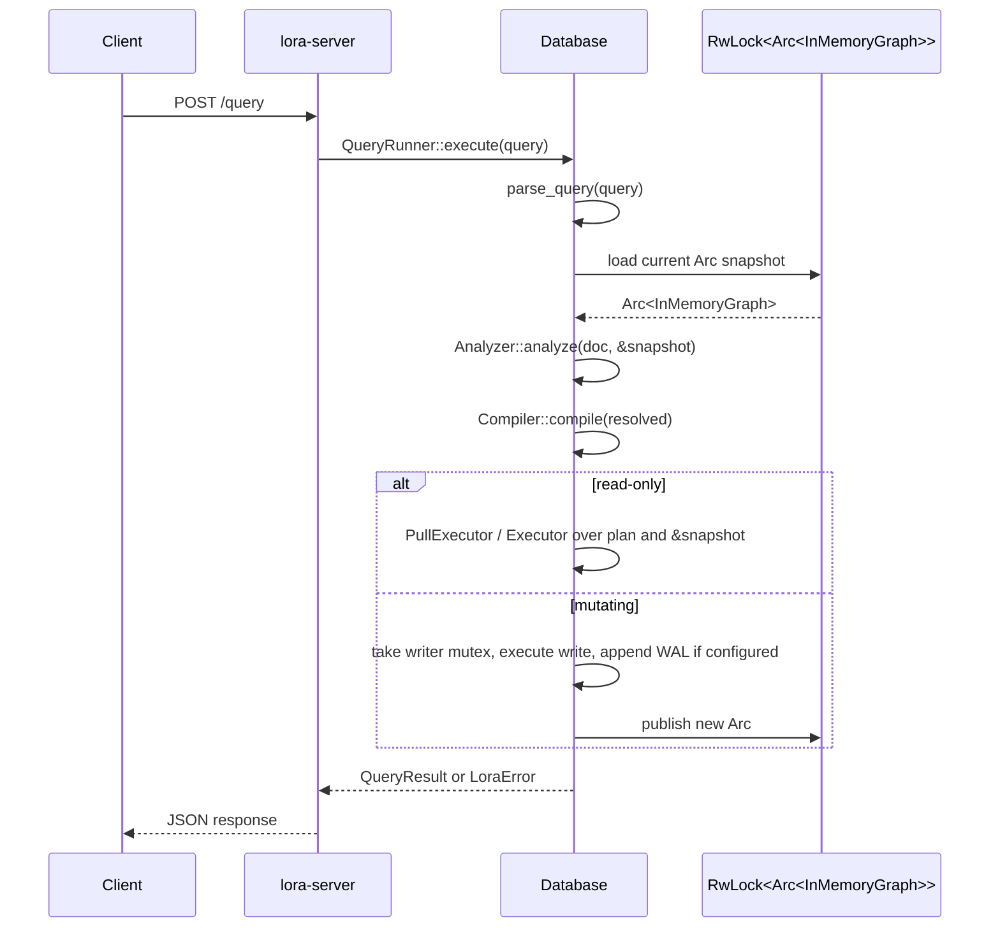

# Data Flow

## Query execution pipeline

Every Cypher query passes through five stages:

```
HTTP Request
    |
    v
1. PARSE         lora-parser     text -> Document (AST)
    |
    v
2. ANALYZE       lora-analyzer   Document -> ResolvedQuery
    |                              (scoping and functions; never reads the graph)
    v
3. COMPILE       lora-compiler   ResolvedQuery + GraphStats -> LogicalPlan -> PhysicalPlan
    |                              (includes optimizer pass and index selection)
    v
4. EXECUTE       lora-executor     PhysicalPlan -> RowSource pipeline -> rows
    |                              (reads/writes InMemoryGraph)
    v
5. PROJECT       lora-executor     rows -> QueryResult (JSON-serializable)
    |
    v
HTTP Response
```

The pipeline is orchestrated by `lora_database::Database::execute` / `execute_with_params`. The HTTP server (`lora-server`) is a thin transport on top of it.

## Detailed stage breakdown

### Stage 1: Parsing

**Input**: raw Cypher string
**Output**: `Document` (typed AST)
**Crate**: `lora-parser`

The pest PEG grammar (`src/cypher.pest`) defines the syntax. The parser produces a pest parse tree which is lowered into the typed AST defined in `lora-ast` (lowering lives in `src/parser/`). Every AST node carries a `Span { start, end }` (byte offsets) for error reporting.

**Error path**: `ParseError` with a human-readable message and span.

### Stage 2: Semantic analysis

**Input**: `Document` (the constructor still takes `&S where S: GraphCatalog`, but the analyzer does not read it)
**Output**: `ResolvedQuery`
**Crate**: `lora-analyzer`

The analyzer walks the AST and:

- Resolves variables using a `ScopeStack` (lexical scoping)
- Assigns `VarId` identifiers to each variable binding
- Accepts any label, relationship type, or property key: the analyzer does not
  read the graph, so a query's validity never depends on the data. An unknown
  label or type matches nothing; an unknown property reads `null`
  (`property_access_allowed` in `src/analyzer/state.rs` always returns `true`)
- Detects duplicate variables, duplicate map keys, duplicate projection aliases
- Validates relationship range bounds (`*min..max`)
- Rejects aggregation in `WHERE`
- Rewrites in-query `CALL db.index.{vector,fulltext}.query*(...) YIELD ...`
  into `UNWIND` + `WITH` over an index function; any other procedure is
  `SemanticError::UnsupportedFeature`. `CALL { ... }` subqueries resolve to
  `CallSubquery`. A standalone `CALL` never reaches the analyzer:
  `Database` dispatches it directly (`src/database/procedures.rs`)
- Checks UNION branches have matching column counts and names
- Checks function names and arities against `lora-builtins-meta`, the table
  the executor also dispatches on

**Error path**: `SemanticError` covers unknown variables / functions, duplicates, arity errors, unsupported features.

### Stage 3: Compilation

**Input**: `ResolvedQuery`
**Output**: `CompiledQuery { logical: LogicalPlan, physical: PhysicalPlan }`
**Crate**: `lora-compiler`

#### Logical planning

The `Planner` converts resolved clauses into a plan graph represented as `Vec<LogicalOp>` with index-based references:

| Resolved clause | Logical operator(s) |
|-----------------|---------------------|
| `MATCH` pattern | `NodeScan` + `Expand` + `Filter` (+ `PathBuild` if path bound) |
| `OPTIONAL MATCH` | `OptionalMatch` wrapping a subplan |
| `WHERE` | `Filter` |
| `RETURN` | `Projection` (+ `Sort`, `Limit`) |
| `WITH` | `Projection` (+ `Filter`, `Sort`, `Limit`) |
| `CREATE` | `Create` |
| `MERGE` | `Merge` |
| `DELETE` / `DETACH DELETE` | `Delete` |
| `SET` | `Set` |
| `REMOVE` | `Remove` |
| `UNWIND` | `Unwind` |
| `FOREACH` | `Foreach` |
| `CALL { ... }` | `CallSubquery` |
| `UNION` / `UNION ALL` | two subplans combined with `Projection` + deduplication |

Inline property maps (for example `(n:User {id: 1})`) are converted into `Filter` operators with equality predicates during pattern planning.

#### Optimization

Current rules:

- **Filter push-down**: move `Filter` below `Projection` when safe (not `DISTINCT`, not star projection)
- **Catalog-backed index selection**: rewrite eligible `Filter(NodeScan)` and
  `Filter(Expand(unconstrained NodeScan))` sites to property / RANGE / TEXT /
  POINT physical scans when an online matching catalog entry exists and the
  cost model (`GraphStats`) prefers it over the base scan.
- **Index-ordered sorts**: when a single-key `ORDER BY` names the property a
  range scan already walks, the scan emits rows in index order and the `Sort`
  becomes a pass-through, so `ORDER BY ... LIMIT m` stops after `m` rows.
- **Top-k sort annotation**: mark `ORDER BY ... LIMIT k` shapes so the
  executor can use the bounded sort implementation.

`remove_redundant_limit` is wired into the pipeline but is an empty
placeholder today.

#### Physical lowering

Maps logical operators to physical operators with minor specialization:

- `NodeScan` with a label becomes `NodeByLabelScan`
- `id(n) = value` / `IN list` conjuncts lower to `NodeByIdSeek`, and
  `id(r)` ones over a single-hop expand to `RelByIdSeek`
- Indexed predicates can lower to `NodeByPropertyScan`,
  `NodeByPropertyRangeScan`, `NodeByTextScan`, `NodeByPointScan`,
  `RelByPropertyRangeScan`, `RelByTextScan`, or `RelByPointScan`
- `Aggregation` becomes `HashAggregation`
- `PathBuild` carries a `shortest_path_all: Option<bool>` flag: `None` = normal path, `Some(false)` = `shortestPath()`, `Some(true)` = `allShortestPaths()`

### Stage 4: Execution

**Input**: `PhysicalPlan` + `&S: GraphStorage` (reads) or `&mut S: GraphStorageMut` (writes)
**Output**: a `RowSource` cursor, or `Vec<Row>` when collected
**Crate**: `lora-executor`

There are two execution models over the same `PhysicalPlan`:

- **Pull pipeline** (`src/pull/mod.rs`). `PullExecutor::open_compiled` and
  `MutablePullExecutor::open_compiled` turn the plan into a tree of
  `RowSource` cursors, one per operator, and each pulls rows from its
  upstream on demand, so a `LIMIT` stops the scan below it. Sort and
  aggregation buffer their input internally and then yield lazily;
  deduplicating operators keep only their seen-key set. Hydration happens
  once, in a `HydratingSource` at the top, so intermediate operators work on
  storage-borrowed values. Operators without a streaming source fall back to
  the buffered executor for that subtree.
- **Buffered executor** (`src/executor/`). `Executor` / `MutableExecutor`
  materialise each operator's output into a `Vec<Row>`, recursively from the
  root.

Which one runs depends on the entry point. `stream*` (on `Database` and on a
`Transaction`) uses the pull pipeline. `execute*` uses the pull
collector for read-only plans with an early `LIMIT` and no blocking operator
between it and the scan (`src/database/pull_mode.rs`), and the buffered
executors for other reads and for writes (a transaction's `execute*` is
always buffered).

**Physical operators** (in `lora-compiler/src/physical.rs`):
- `Argument`, `NodeScan`, `NodeByLabelScan`, `NodeByIdSeek`, `NodeByPropertyScan`,
  `NodeByPropertyRangeScan`, `NodeByTextScan`, `NodeByPointScan`,
  `RelByPropertyRangeScan`, `RelByTextScan`, `RelByPointScan`, `RelByIdSeek`,
  `Expand` (variable-length aware), `Filter`, `Projection`, `Unwind`,
  `HashAggregation`, `Sort`, `Limit`, `Create`, `Merge`, `Delete`, `Set`,
  `Remove`, `Foreach`, `OptionalMatch`, `PathBuild`, `CallSubquery`

Each side has a read-only and a mutable executor:

- `PullExecutor` / `Executor<S: GraphStorage>` — read-only; write operators return `ExecutorError::ReadOnly*`
- `MutablePullExecutor` / `MutableExecutor<S: GraphStorageMut>` — support all operators

Expression evaluation is handled by `eval_expr` in `lora-executor/src/eval/` (`expr.rs`, with function dispatch in `functions.rs` and `builtins/`), which recurses over `ResolvedExpr` nodes and dispatches function names.

Shortest-path variants of `PathBuild` run the normal variable-length expand and then pass the results through `filter_shortest_paths`, which retains either one minimum-hop path (`shortestPath`) or every minimum-hop path (`allShortestPaths`).

**Mutation events.** `MutableExecutor` writes go through `GraphStorageMut`. Every mutation fires a `MutationEvent` at an optional `MutationRecorder` on the store (none by default). The emit path is a single null-pointer check when no recorder is installed, so read-only and no-durability workloads pay zero cost. See [graph-engine.md#durability](graph-engine.md#durability) for the trait, [../internals/ingestion.md](../internals/ingestion.md) for the write path, and [../operations/snapshots.md#mutation-events](../operations/snapshots.md#mutation-events) for the recorder contract.

### Stage 5: Result projection

**Input**: rows + `ExecuteOptions { format }`
**Output**: `QueryResult`

Before projection, rows are **hydrated**: `LoraValue::Node(id)` and `LoraValue::Relationship(id)` are expanded into maps containing `{kind, id, labels, properties}` or `{kind, id, startId, endId, type, properties}` (the `startId` / `endId` JSON names come from `serde(rename)` on `HydratedRelationship`; the in-Rust `RelationshipRecord` fields are still called `src` / `dst`). `LoraValue::Path(...)` expands into a sequence of hydrated nodes and relationships.

Four output formats:

- `rows` — array of maps (variable name → value)
- `rowArrays` — `{columns, rows}` with positional arrays
- `graph` — extracted node and relationship projections (**default**)
- `combined` — columns + row arrays + graph projection combined

## Concurrency model

`Database<InMemoryGraph>` stores the current graph as a `RwLock<Arc<S>>`
(`src/live_store.rs`). Read-only auto-commit queries take the read lock just
long enough to clone the `Arc<InMemoryGraph>`, then analyze, compile, and
execute without holding a store lock. Existing readers keep their snapshot
alive even if a writer publishes a newer graph.

Mutating auto-commit queries are single-writer (`src/database/occ.rs`,
`src/database/write_guard.rs`). The module names still say "optimistic"; the
seam is kept for a future write-set/CAS implementation, but there is no
validate-and-retry step today:

1. Take the database writer mutex, so writes and WAL records are serialized.
2. Staged path: clone the current `InMemoryGraph` (records and indexes are
   shared copy-on-write), run the write against the clone while the WAL
   recorder buffers mutation events, commit the WAL, then publish the clone
   by replacing the `Arc` under the write lock. A failure discards the clone.
3. Live fast path: plans proven unable to fail midway, with no deadline, run
   directly against the live graph through `Arc::make_mut`. If one fails after
   emitting WAL events anyway, the recorder is poisoned.

Explicit transactions use a different rule: read-only transactions pin a
snapshot; read-write transactions hold the writer mutex for the transaction
lifetime and publish on `commit`.

Snapshot save encodes the loaded `Arc` snapshot outside a write lock, writes
`<path>.tmp`, fsyncs, renames, and best-effort fsyncs the parent directory.
Snapshot load decodes a full graph and publishes it by swapping the current
`Arc`. WAL checkpoints pair a snapshot with a durable WAL LSN fence and then
write a checkpoint marker.

`execute_with_timeout` and `execute_with_params_timeout` add cooperative
deadline checks during lock acquisition and executor work; they are cancellation
points, not preemptive thread interruption. The checks sit at operator
boundaries, in every per-row loop (scans, filter, projection, unwind, pulls
through the pipeline) and inside expression evaluation: pattern and list
comprehensions, `reduce`, `any`/`all`/`none`/`single` and pattern-subquery
expansion read the clock every 256 iterations, so one `WHERE` that nests
comprehensions (what `@loradb/lora-graphql` emits for relationship filters)
stops within about a millisecond of the deadline. An expression that stopped
early marks the thread, and its incomplete value never reaches a result.


```mermaid
sequenceDiagram
    participant C as Client
    participant S as lora-server
    participant D as Database
    participant M as RwLock<Arc<InMemoryGraph>>

    C->>S: POST /query
    S->>D: QueryRunner::execute(query)
    D->>D: parse_query(query)
    D->>M: load current Arc snapshot
    M-->>D: Arc<InMemoryGraph>
    D->>D: Analyzer::analyze(doc, &snapshot)
    D->>D: Compiler::compile(resolved)
    alt read-only
        D->>D: PullExecutor / Executor over plan and &snapshot
    else mutating
        D->>D: take writer mutex, execute write, append WAL if configured
        D->>M: publish new Arc
    end
    D-->>S: QueryResult or LoraError
    S-->>C: JSON response
```

## Next steps

- Storage internals the executor reads from: [Graph Engine](graph-engine.md)
- Add support for a new Cypher construct: [Cypher Development](../internals/cypher-development.md)
- Durability and the mutation-event surface: [Snapshots](../operations/snapshots.md)
- Understand performance characteristics of each stage: [Performance Notes](../performance/notes.md)
- Benchmarks for the full pipeline: [Benchmarks](../performance/benchmarks.md)
