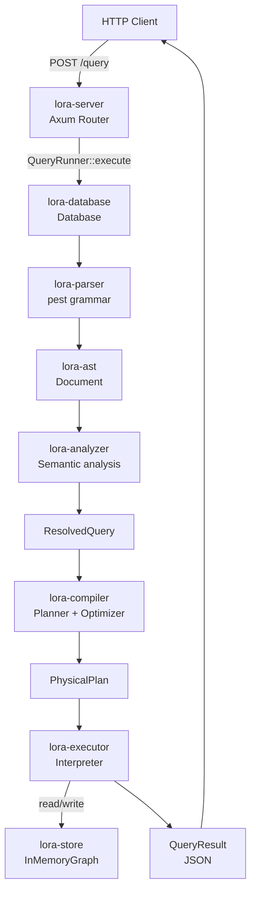

# Architecture Overview

## System summary

Lora is a Rust workspace implementing an **in-memory property graph database** with a **Cypher-like query language** (see the [Cypher support matrix](../reference/cypher-support-matrix.md) for the exact subset). The entire query pipeline and storage engine are implemented from scratch — there is no external graph database behind it.

The **core engine** is structured as a compiler-style pipeline plus storage,
durability, orchestration, and transport crates (described below). The wider
workspace additionally contains binding surfaces that all wrap this same
pipeline:

- `crates/bindings/lora-ffi` — Rust crate exposing a C ABI over `Database`
- `crates/bindings/lora-node`, `crates/bindings/lora-wasm`, `crates/bindings/lora-python`, `crates/bindings/lora-ruby` — Rust crates that are cargo workspace members and compile to native extensions for their respective runtimes
- `crates/bindings/lora-go` — a Go module (not a cargo crate) that cgo-links against `lora-ffi`
- `crates/bindings/shared-ts` — shared TypeScript type declarations consumed by `lora-node` and `lora-wasm` (source only, not a cargo crate)

These are documented elsewhere and are not part of the core pipeline count here.

```
Cypher text
    |
    v
[lora-parser]    PEG grammar (pest) -> AST
    |
    v
[lora-analyzer]  semantic analysis -> ResolvedQuery
    |
    v
[lora-compiler]  logical plan -> optimizer -> physical plan
    |
    v
[lora-executor]    interpret physical plan against [lora-store]
    |
    v
[lora-database]    owns the store and drives the pipeline end-to-end
    |
    v
[lora-server]      Axum HTTP / JSON transport
    |
    v
JSON result
```

## Crate responsibilities

### lora-ast

Pure data definitions. All AST node types (`Document`, `Statement`, `Query`, `Expr`, `Pattern`, …) carry a `Span` for error reporting. Depends only on `smallvec`.

**Key file**: `src/ast.rs`

### lora-parser

Defines the Cypher grammar in PEG notation (pest) and lowers parse trees into the typed AST from `lora-ast`. Exposes `parse_query(&str) -> Result<Document>`.

**Key files**:
- `src/cypher.pest` — the grammar
- `src/parser.rs` — pest-pair-to-AST lowering

### lora-store

Defines the `GraphStorage` (read), `BorrowedGraphStorage`, `GraphCatalog`, and
`GraphStorageMut` (write) traits and provides `InMemoryGraph`, a slot-indexed
in-memory implementation with adjacency vectors, label/type indexes, and lazy
exact-match property indexes. Also defines the binary, temporal, spatial, and
vector value types (`LoraBinary`, `LoraDate`, `LoraTime`, `LoraLocalTime`,
`LoraDateTime`, `LoraLocalDateTime`, `LoraDuration`, `LoraPoint`, `LoraVector`)
shared between the store and the executor. Owns the `MutationEvent` /
`MutationRecorder` surface that the WAL and archive layers build on.

**Key files**:
- `src/traits.rs` — storage traits and default helpers
- `src/types/graph.rs` — `NodeRecord`, `RelationshipRecord`, identifiers
- `src/types/property_value.rs` — `PropertyValue`
- `src/types/binary/`, `src/types/temporal/`, `src/types/spatial/`, `src/types/vector/` — typed property values
- `src/memory/` — `InMemoryGraph`, mutation implementation, property indexes
- `src/snapshot.rs` — `SnapshotPayload` bridge consumed by `lora-snapshot`
- `src/mutation.rs` — `MutationEvent` enum, `MutationRecorder` trait

### lora-snapshot

Columnar snapshot codec. Encodes full graph payloads into the current
`LORACOL1` envelope with a bincode manifest, BLAKE3 checksum, optional gzip
compression, and optional ChaCha20-Poly1305 encryption.

**Key files**:
- `src/format.rs` — magic, format version, body format version
- `src/envelope.rs` — manifest, checksum, encryption metadata
- `src/codec.rs` — encode/decode API
- `src/options.rs` — compression and encryption options

### lora-wal

Write-ahead log segment implementation. Stores committed mutation batches in
numbered `*.wal` files, uses GroupSync durability, and replays only committed
records.

**Key files**:
- `src/config.rs` — `WalConfig`, `SyncMode`, segment sizing
- `src/record.rs` — WAL record kinds and framing payloads
- `src/wal.rs` — append, replay, fsync, truncate

### lora-analyzer

Semantic analysis pass. Takes an AST `Document` plus a `&dyn GraphStorage` reference, resolves variable scoping, validates labels / types / properties against the live graph for read contexts, and produces a `ResolvedQuery` with `VarId`-based bindings.

**Key files**:
- `src/analyzer.rs` — main analysis logic
- `src/resolved.rs` — resolved IR types
- `src/scope.rs` — `ScopeStack` for variable scoping
- `src/symbols.rs` — `VarId` and `SymbolTable`
- `src/errors.rs` — `SemanticError` enum

### lora-compiler

Two-phase compilation:

1. **Planner** — converts `ResolvedQuery` into a `LogicalPlan` (a vector of `LogicalOp` nodes with a root index)
2. **Optimizer** — applies rewrite rules (currently: push filters below projections)
3. **Lowering** — converts `LogicalPlan` into `PhysicalPlan` (for example, `NodeScan` with a label becomes `NodeByLabelScan`, `Aggregation` becomes `HashAggregation`)

**Key files**:
- `src/logical.rs` — logical operator definitions
- `src/physical.rs` — physical operator definitions
- `src/planner.rs` — logical plan construction
- `src/pattern.rs` — pattern-specific planning (node scans, expands, inline property filters, shortest-path flag propagation)
- `src/optimizer.rs` — rewrite rules and physical lowering

### lora-executor

Interprets a `PhysicalPlan` against a `GraphStorage` (read-only) or `GraphStorageMut` (writes). Uses a row-at-a-time Volcano-style model. Contains expression evaluation, value types, and result projection into multiple output formats.

**Key files**:
- `src/executor.rs` — `Executor` (read-only) and `MutableExecutor`
- `src/eval.rs` — expression evaluator and function dispatch
- `src/value.rs` — `LoraValue` enum, `Row`, `QueryResult`, projection logic
- `src/errors.rs` — `ExecutorError` enum

### lora-database

Orchestration layer. Owns an `ArcSwap<S>` current-store pointer, a writer mutex
for publishing writes and explicit read-write transactions, optional WAL /
managed snapshot state, and a plan cache. Exposes `Database` entry points for
materialized execution, parameterized execution, cooperative timeouts, row
streams, explicit transactions, direct graph mutations, snapshots, WAL recovery,
managed snapshots, and named `.loradb` archive-backed databases.

**Key files**:
- `src/database/mod.rs` — `Database` struct and snapshot publishing model
- `src/database/builder.rs` — in-memory, WAL, managed snapshot, named archive, and recovery constructors
- `src/database/execute.rs` — parse/analyze/compile/execute flow
- `src/database/occ.rs` — optimistic auto-commit write publishing
- `src/database/stream.rs`, `src/stream.rs` — row streaming API
- `src/transaction.rs` — explicit read-only and read-write transactions
- `src/snapshot/` — snapshot admin, JSON options, managed snapshot store
- `src/wal/`, `src/named.rs` — WAL recorder integration and `.loradb` archives
- `src/lib.rs` — public re-exports

The integration test suite for the full pipeline lives here under `tests/`.

### lora-server

Thin Axum-based HTTP transport. Wraps any `QueryRunner` implementation — by
default `Arc<Database<InMemoryGraph>>`. No pipeline logic of its own.

**Key files**:
- `src/main.rs` — entry point; opens in-memory, snapshot-restored, WAL-backed, or snapshot+WAL recovered databases
- `src/config/` — hand-rolled CLI/env parser for host, port, snapshot path, restore path, WAL directory, and WAL sync mode
- `src/app.rs` — `GET /health`, `POST /query`, structured error responses, and opt-in snapshot/WAL admin routes

## Architecture diagram



## Design principles (observed)

1. **Compiler-style pipeline** — each stage has a well-defined input and output type
2. **Trait-based storage** — `GraphStorage` / `GraphStorageMut` allow alternative backends
3. **ID-based references** — `VarId`, `NodeId`, `RelationshipId` are simple numeric types; string names are resolved once during analysis
4. **Read / write separation** — the executor has distinct `Executor` and `MutableExecutor` structs
5. **Plan-based execution** — queries compile to explicit plans; the executor never interprets the AST directly
6. **Transport-agnostic core** — `lora-database` exposes a `QueryRunner` trait so HTTP, benches, examples, and embedded callers share one pipeline
7. **Zero external runtime dependencies** — no database, no JVM, pure Rust

> 💡 **Tip** — The transport-agnostic `QueryRunner` trait means the same pipeline drives HTTP (`lora-server`), embedded Rust consumers (`lora-database`), the language bindings (`lora-node`, `lora-python`, `lora-wasm`, `lora-ruby`), and the `lora-ffi` C ABI that `lora-go` cgo-links against. If you need a custom transport, implement `QueryRunner` — you don't need to touch any pipeline crate.

## Next steps

- Walk through a query in detail: [Data Flow](data-flow.md)
- Understand the storage internals: [Graph Engine](graph-engine.md)
- Durability, snapshot wire format, admin surface: [Snapshots](../operations/snapshots.md)
- Add a new clause or function: [Cypher Development](../internals/cypher-development.md)
- Run and operate the server: [Deployment](../operations/deployment.md)
- For managed, multi-node deployments with persistence and replication: [LoraDB platform](https://loradb.com)
