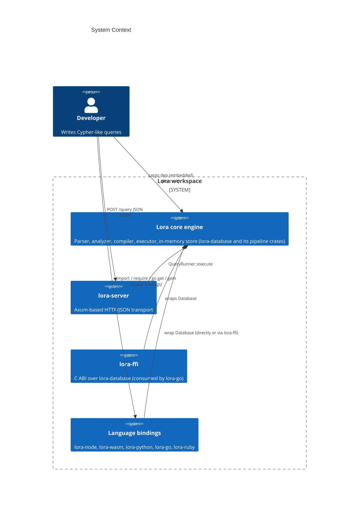

# System Context

## What Lora is

An in-memory property graph database with a Cypher-like query language (a broad, tested subset — see the [Cypher support matrix](../reference/cypher-support-matrix.md) for the exact list of supported clauses, functions, and data types), written in Rust. It provides:

- A PEG-based Cypher parser (pest) covering the supported subset
- Semantic analysis with variable scoping and schema validation
- A query compiler with logical and physical plan stages
- An optimizer framework (currently filter push-down)
- A row-at-a-time physical plan executor
- An in-memory graph store with secondary indexes
- Multiple ways to reach the engine: direct embedding from Rust, an HTTP/JSON server, and language bindings for Node, WebAssembly, Python, Go (via a shared C ABI), and Ruby

## What Lora is not

- **Not a client for another graph database** -- it is a standalone engine, not a driver
- **Not a distributed system** -- single-process, single-thread execution
- **Not continuously durable** -- point-in-time snapshots exist (`save_snapshot_to` / `load_snapshot_from`; see [operations/snapshots.md](../operations/snapshots.md)); no WAL, no replication. Data between saves is lost on crash.
- **Not openCypher-complete** -- implements a working subset of Cypher (see the support matrix for the specific clauses and functions that are covered, partial, or not yet implemented)
- **Not production-grade** -- no authentication, only point-in-time persistence, no replication

> 🚀 **Production note** — The core engine is deliberately scoped to local and embedded use. Production concerns (continuous durability, replication, authentication, backups, multi-tenant isolation) are handled by the managed LoraDB platform at **<https://loradb.com>**, which runs the same Cypher surface on top.

## System boundary diagram

## External dependencies

### Runtime

| Dependency | Version | Purpose |
|-----------|---------|---------|
| `axum` | 0.x | HTTP framework |
| `tokio` | 1.x | Async runtime (single-threaded) |
| `pest` / `pest_derive` | 2.x | PEG parser generator |
| `serde` / `serde_json` | 1.x | JSON serialization |
| `smallvec` | 2.0.0-alpha | Small-buffer-optimized vectors for labels/types |
| `anyhow` | 1.x | Error handling in server |
| `thiserror` | 2.x | Typed error enums |
| `tracing` | 0.x | Structured logging |
| `tower` | 0.5.x | HTTP middleware |

### Development / build

| Tool | Purpose |
|------|---------|
| Rust stable | Compiler toolchain |
| rustfmt | Code formatting |
| clippy | Linting |

## Integration points

The engine is reached through **multiple in-process surfaces**, all of which ultimately drive the same `lora_database::Database` pipeline:

- **Direct Rust embedding** — depend on the `lora-database` crate and call `Database::execute` / `execute_with_params` from any host binary or library.
- **HTTP API** (`lora-server`) — `POST /query` accepts `{"query": "...", "format": "..."}` and returns JSON.
- **C ABI** (`lora-ffi`) — a `#[no_mangle]` C-compatible surface around `Database`, used by the Go binding and available to any third-party cgo-style consumer.
- **Language bindings** — `lora-node` (napi-rs), `lora-wasm` (wasm-bindgen / wasm-pack), `lora-python` (PyO3), `lora-go` (cgo over `lora-ffi`), `lora-ruby` (Magnus / rb-sys).

All of these live in this workspace; see `crates/lora-server`, `crates/lora-ffi`, `crates/lora-node`, `crates/lora-wasm`, `crates/lora-python`, `crates/lora-go`, and `crates/lora-ruby`. There are no message queues, database connections, file watchers, or scheduled jobs. The graph exists entirely within the host process address space.

## Next steps

- Dig into the pipeline: [Architecture Overview](overview.md) → [Data Flow](data-flow.md)
- See how the graph itself is stored: [Graph Engine](graph-engine.md)
- Operate the server: [Deployment](../operations/deployment.md), [Security](../operations/security.md)
- Evaluating for production? See [LoraDB managed platform](https://loradb.com)
