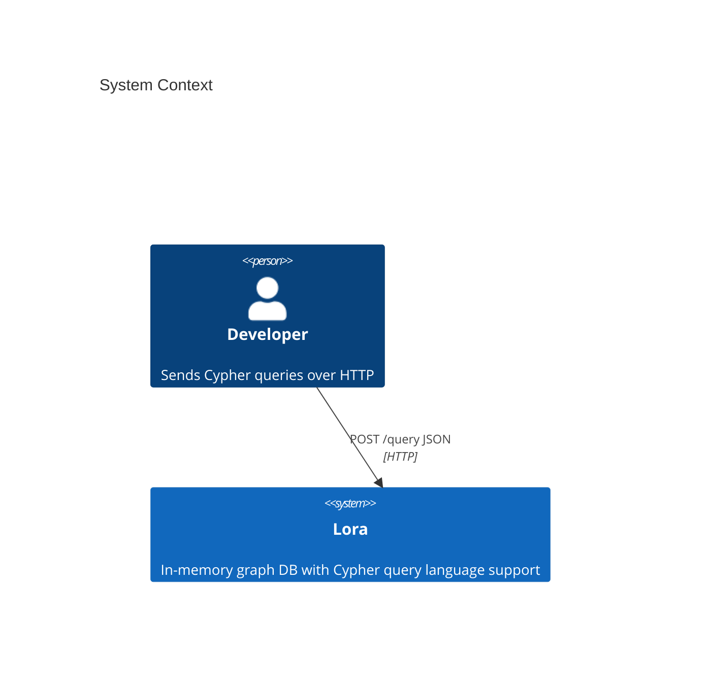

# System Context

## What Lora is

An in-memory property graph database with full Cypher query language support, written in Rust. It provides:

- A complete Cypher parser (PEG-based via pest)
- Semantic analysis with variable scoping and schema validation
- A query compiler with logical and physical plan stages
- An optimizer framework (currently filter push-down)
- A row-at-a-time physical plan executor
- An in-memory graph store with secondary indexes
- An HTTP/JSON API for query submission

## What Lora is not

- **Not a client for another graph database** -- it is a standalone engine, not a driver
- **Not a distributed system** -- single-process, single-thread execution
- **Not a persistent database** -- all data lives in memory and is lost on restart
- **Not openlora-complete** -- implements a working subset of Cypher
- **Not production-grade** -- no authentication, no persistence, no replication

> 🚀 **Production note** — The core engine is deliberately scoped to local and embedded use. Production concerns (persistence, replication, authentication, backups, multi-tenant isolation) are handled by the managed LoraDB platform at **<https://loradb.com>**, which runs the same Cypher surface on top.

## System boundary diagram

## External dependencies

### Runtime

| Dependency | Version | Purpose |
|-----------|---------|---------|
| `axum` | 0.x | HTTP framework |
| `tokio` | 1.x | Async runtime (single-threaded) |
| `pest` / `pest_derive` | 2.x | PEG parser generator |
| `serde` / `serde_json` | 1.x | JSON serialization |
| `smallvec` | 2.0.0-alpha | Small-buffer-optimized vectors for labels/types |
| `anyhow` | 1.x | Error handling in server |
| `thiserror` | 2.x | Typed error enums |
| `tracing` | 0.x | Structured logging |
| `tower` | 0.5.x | HTTP middleware |

### Development / build

| Tool | Purpose |
|------|---------|
| Rust stable | Compiler toolchain |
| rustfmt | Code formatting |
| clippy | Linting |

## Integration points

The system has exactly one integration point:

- **HTTP API** -- `POST /query` accepts `{"query": "...", "format": "..."}` and returns JSON

There are no message queues, database connections, file watchers, or scheduled jobs. The graph exists entirely within the process address space.

## Next steps

- Dig into the pipeline: [Architecture Overview](overview.md) → [Data Flow](data-flow.md)
- See how the graph itself is stored: [Graph Engine](graph-engine.md)
- Operate the server: [Deployment](../operations/deployment.md), [Security](../operations/security.md)
- Evaluating for production? See [LoraDB managed platform](https://loradb.com)
