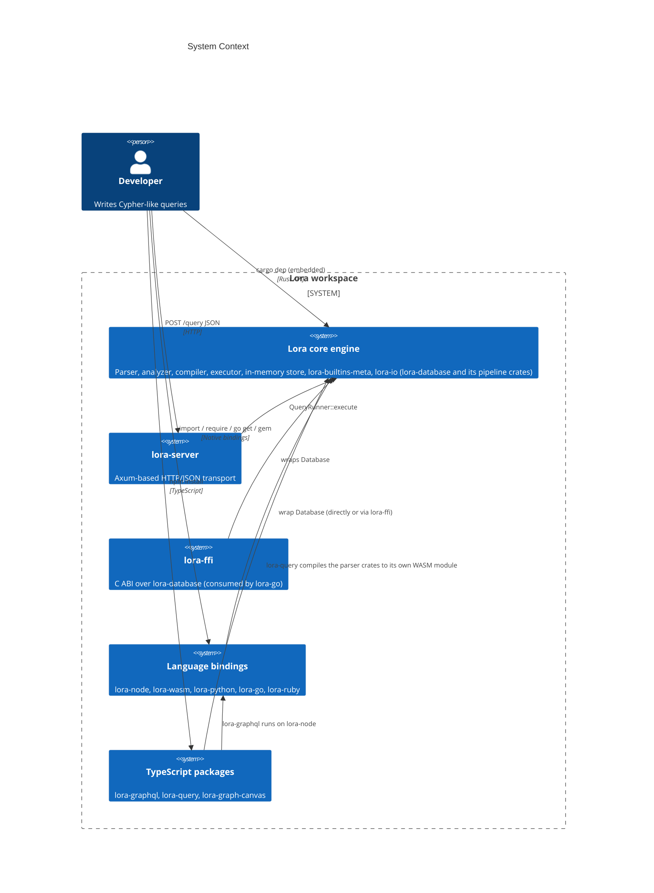

# System Context

## What Lora is

An in-memory property graph database with a Cypher-like query language (a broad, tested subset — see the [Cypher support matrix](../reference/cypher-support-matrix.md) for the exact list of supported clauses, functions, and data types), written in Rust. It provides:

- A PEG-based Cypher parser (pest) covering the supported subset
- Semantic analysis with variable scoping and function validation (it does not read the graph, so unknown labels, types and property keys are not errors)
- A query compiler with logical and physical plan stages
- An optimizer with filter push-down, cost-scored index selection for node and
  relationship scans, index-ordered sorts, and top-k sort annotation
- A physical plan executor with a pull-based `RowSource` pipeline (streams, early-`LIMIT` reads) and a buffered fallback
- An in-memory graph store with secondary indexes (property, range, text, point, fulltext, and flat or HNSW vector)
- Row import/export as JSONL, JSON, or CSV (`lora-io`)
- Multiple ways to reach the engine: direct embedding from Rust, an HTTP/JSON server, and language bindings for Node, WebAssembly, Python, Go (via a shared C ABI), and Ruby
- TypeScript packages on top of the Node/WASM bindings: GraphQL (`@loradb/lora-graphql`), a Cypher editor (`@loradb/lora-query`), and a graph canvas (`@loradb/lora-graph-canvas`)

## What Lora is not

- **Not a client for another graph database** -- it is a standalone engine, not a driver
- **Not a distributed system** -- one process owns one graph
- **Not replicated or clustered** -- point-in-time snapshots and optional WAL-backed recovery exist (`save_snapshot_to`, `load_snapshot_from`, `open_with_wal`; see [Snapshots](../operations/snapshots.md) and [WAL](../operations/wal.md)), but there is no replication or distributed storage. Without WAL, data between saves is lost on crash.
- **Not openCypher-complete** -- implements a working subset of Cypher (see the support matrix for the specific clauses and functions that are covered, partial, or not yet implemented)
- **Not a managed production tier by itself** -- the bare HTTP server has no authentication, TLS, metrics, or replication; durability is local to snapshots / WAL and remains operator-managed

> 🚀 **Production note** — The core engine is deliberately scoped to local and embedded use. Production concerns (continuous durability, replication, authentication, backups, multi-tenant isolation) are handled by the managed LoraDB platform at **<https://loradb.com>**, which runs the same Cypher surface on top.

## System boundary diagram

```mermaid
C4Context
    title System Context

    Person(dev, "Developer", "Writes Cypher-like queries")

    System_Boundary(lora_ws, "Lora workspace") {
      System(lora_core, "Lora core engine", "Parser, analyzer, compiler, executor, in-memory store, lora-builtins-meta, lora-io (lora-database and its pipeline crates)")
      System(lora_server, "lora-server", "Axum-based HTTP/JSON transport")
      System(lora_ffi, "lora-ffi", "C ABI over lora-database (consumed by lora-go)")
      System(lora_bindings, "Language bindings", "lora-node, lora-wasm, lora-python, lora-go, lora-ruby")
      System(lora_packages, "TypeScript packages", "lora-graphql, lora-query, lora-graph-canvas")
    }

    Rel(dev, lora_core, "cargo dep (embedded)", "Rust API")
    Rel(dev, lora_server, "POST /query JSON", "HTTP")
    Rel(dev, lora_bindings, "import / require / go get / gem", "Native bindings")
    Rel(lora_server, lora_core, "QueryRunner::execute")
    Rel(lora_ffi, lora_core, "wraps Database")
    Rel(lora_bindings, lora_core, "wrap Database (directly or via lora-ffi)")
    Rel(dev, lora_packages, "npm install", "TypeScript")
    Rel(lora_packages, lora_bindings, "lora-graphql runs on lora-node")
    Rel(lora_packages, lora_core, "lora-query compiles the parser crates to its own WASM module")
```

## External dependencies

### Runtime

| Dependency | Version | Purpose |
|-----------|---------|---------|
| `axum` | 0.x | HTTP framework |
| `tokio` | 1.x | Async runtime (single-threaded) |
| `pest` / `pest_derive` | 2.x | PEG parser generator |
| `serde` / `serde_json` | 1.x | JSON serialization |
| `smallvec` | 2.0.0-alpha | Small-buffer-optimized vectors for labels/types |
| `anyhow` | 1.x | Error handling in server |
| `thiserror` | 2.x | Typed error enums |
| `tracing` | 0.x | Structured logging |
| `tower` | 0.5.x | HTTP middleware |

### Development / build

| Tool | Purpose |
|------|---------|
| Rust stable | Compiler toolchain |
| rustfmt | Code formatting |
| clippy | Linting |

## Integration points

The engine is reached through **multiple in-process surfaces**, all of which ultimately drive the same `lora_database::Database` pipeline:

- **Direct Rust embedding** — depend on the `lora-database` crate and call `Database::execute` / `execute_with_params` from any host binary or library.
- **HTTP API** (`lora-server`) — `POST /query` accepts `{"query": "...", "params": {...}, "format": "..."}` and returns JSON. `params` and `format` are optional.
- **C ABI** (`lora-ffi`) — a `#[no_mangle]` C-compatible surface around `Database`, used by the Go binding and available to any third-party cgo-style consumer.
- **Language bindings** — `lora-node` (napi-rs), `lora-wasm` (wasm-bindgen / wasm-pack), `lora-python` (PyO3), `lora-go` (cgo over `lora-ffi`), `lora-ruby` (Magnus / rb-sys).
- **TypeScript packages** — `packages/lora-graphql` (schema-first GraphQL over `lora-node`), `packages/lora-query` (React CodeMirror editor; ships its own WASM build of the parser crates for validation and formatting), `packages/lora-graph-canvas` (React 2D/3D graph canvas).

All of these live in this workspace; see `crates/lora-server`, `crates/bindings/lora-ffi`, `crates/bindings/lora-node`, `crates/bindings/lora-wasm`, `crates/bindings/lora-python`, `crates/bindings/lora-go`, `crates/bindings/lora-ruby`, and `packages/`. There are no message queues, database connections, file watchers, or scheduled jobs. The graph exists entirely within the host process address space.

## Next steps

- Dig into the pipeline: [Architecture Overview](overview.md) → [Data Flow](data-flow.md)
- See how the graph itself is stored: [Graph Engine](graph-engine.md)
- Operate the server: [Deployment](../operations/deployment.md), [Security](../operations/security.md)
- Evaluating for production? See [LoraDB managed platform](https://loradb.com)
