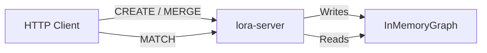

# Ingestion and Pipelines

## How data enters the graph

Most user-facing ingestion flows through **writing Cypher statements (`CREATE`,
`MERGE`, `SET`, …) via `Database::execute` / `execute_with_params`**. What
varies is the surface the caller reaches it through:

- **HTTP** — `POST /query` on `lora-server`
- **Direct Rust** — depend on the `lora-database` crate and call `Database` directly
- **C ABI** — `lora-ffi` exposes the same `Database` pipeline through a C-compatible surface (used by `lora-go`)
- **Language bindings** — `lora-node`, `lora-wasm`, `lora-python`, `lora-go`, `lora-ruby` each wrap the same `Database` calls

The Rust `Database<InMemoryGraph>` also exposes a direct graph API
(`create_node`, `create_relationship`, property/label mutation, delete, and
detach delete) for embedded callers that intentionally bypass Cypher. Those
methods use the same storage mutation primitives and recorder events.

There are no:
- Bulk import tools
- CSV/JSON file loaders
- ETL pipelines
- External streaming ingestion service
- Database migration scripts
- Seed scripts outside the test suite (see [Batch seeding](#batch-seeding))

## HTTP ingestion flow

```
Client -> POST /query {"query": "CREATE ..."} -> lora-server -> Database::execute -> InMemoryGraph
```

The same `Database::execute` / `execute_with_params` entry point handles writes from every other surface listed above.

Every primitive write (`create_node`, `create_relationship`, property set/remove,
label add/remove, delete, detach delete, clear) maps to a `GraphStorageMut`
method, and each method fires a `MutationEvent` at the store's optional
`MutationRecorder`. A single Cypher statement may produce many primitive
mutations. The recorder is `None` by default — no event is constructed, so the
hot path is a single null-pointer check. The shipping consumer of the recorder is
the WAL; install your own via `InMemoryGraph::set_mutation_recorder` for audit
streams, change-data-capture, or replication. See
[../operations/snapshots.md#mutation-events](../operations/snapshots.md#mutation-events)
for the recorder contract and variant list, and [../operations/wal.md](../operations/wal.md)
for how the WAL drives it.

### Creating nodes

```bash
curl -s localhost:4747/query \
  -H 'Content-Type: application/json' \
  -d '{"query": "CREATE (n:User {name: \"Alice\", age: 32}) RETURN n"}'
```

### Creating relationships

Relationships require both endpoint nodes to exist. The typical pattern is to first `MATCH` existing nodes, then `CREATE` the relationship:

```bash
curl -s localhost:4747/query \
  -H 'Content-Type: application/json' \
  -d '{"query": "MATCH (a:User {name: \"Alice\"}), (b:User {name: \"Bob\"}) CREATE (a)-[:FOLLOWS {since: 2024}]->(b) RETURN a, b"}'
```

### Batch seeding

Seed helpers for the test suite live in `crates/lora-database/tests/seeds.rs` (social, org, transport, knowledge, and other fixtures) and are invoked via `TestDb::seed_*` helpers. These run at the Rust API layer; there is no HTTP seed script.

Seeding order matters when creating relationships: the `MATCH` clauses must find the endpoint nodes, so create them first.

### MERGE for idempotent ingestion

`MERGE` can be used for upsert-like behavior:

```cypher
MERGE (n:User {id: 1001}) RETURN n
MERGE (n:User {id: 1002}) ON MATCH SET n.name = 'updated' ON CREATE SET n:New RETURN n
```

## Data lineage

All data originates from Cypher queries submitted by clients. There is no external data source integration.



## Considerations for future ingestion work

### Bulk loading (needs confirmation)

If bulk loading is needed, potential approaches:
1. **Direct Rust graph API** -- bypass the Cypher pipeline, call `Database<InMemoryGraph>` graph methods directly
2. **Batch Cypher endpoint** -- accept an array of queries in a single request
3. **CSV import command** -- parse a CSV and map rows to `CREATE` statements
4. **Snapshot restore** -- encode/decode the graph through the snapshot codec

### Persistence (snapshots and WAL)

LoraDB ships two persistence primitives:

1. **Point-in-time snapshots** — `Database::save_snapshot_to` /
   `load_snapshot_from` / `in_memory_from_snapshot` persist and
   restore the full in-memory graph to a single file. On-disk
   format, atomic-write protocol, compression/encryption options, and admin
   surface are documented in [../operations/snapshots.md](../operations/snapshots.md).
   The codec lives in `crates/lora-snapshot`; the storage payload bridge lives in
   `crates/lora-store/src/snapshot.rs`.

2. **Write-ahead log** —
   `Database::open_with_wal` / `Database::recover` /
   `Database::checkpoint_to`, plus managed snapshot and named database
   constructors. The WAL appends committed `MutationEvent` batches to segment
   files and replays committed transactions on boot. Rust and `lora-server`
   expose the full operator surface; Node, Python, Go, and Ruby expose
   filesystem-backed WAL opens; WASM remains snapshot-only. See
   [../operations/wal.md](../operations/wal.md) for the operator-facing reference
   and [../decisions/0004-wal.md](../decisions/0004-wal.md) for the design.
