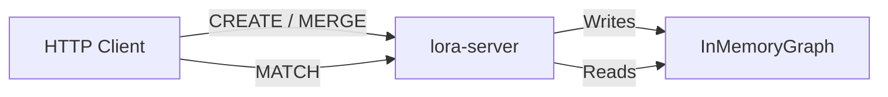

# Ingestion and Pipelines

## How data enters the graph

Lora has one logical ingestion mechanism — **writing Cypher statements (`CREATE`, `MERGE`, `SET`, …) through `Database::execute` / `execute_with_params`**. What varies is the surface the caller reaches it through:

- **HTTP** — `POST /query` on `lora-server`
- **Direct Rust** — depend on the `lora-database` crate and call `Database` directly
- **C ABI** — `lora-ffi` exposes the same `Database` pipeline through a C-compatible surface (used by `lora-go`)
- **Language bindings** — `lora-node`, `lora-wasm`, `lora-python`, `lora-go`, `lora-ruby` each wrap the same `Database` calls

There are no:
- Bulk import tools
- CSV/JSON file loaders
- ETL pipelines
- Streaming ingestion
- Database migration scripts
- Seed scripts outside the test suite (see [Batch seeding](#batch-seeding))

## HTTP ingestion flow

```
Client -> POST /query {"query": "CREATE ..."} -> lora-server -> Database::execute -> InMemoryGraph
```

The same `Database::execute` / `execute_with_params` entry point handles writes from every other surface listed above.

Every write (`CREATE` / `MERGE` / `SET` / `SET +=` / `DELETE` / `DETACH DELETE` / `REMOVE`) maps to exactly one `GraphStorageMut` method call, and each method fires a `MutationEvent` at the store's optional `MutationRecorder`. The recorder is `None` by default — no event is constructed, so the hot path is a single null-pointer check. Install one via `InMemoryGraph::set_mutation_recorder` for audit streams, change-data-capture, or the future WAL. See [../operations/snapshots.md#mutation-events](../operations/snapshots.md#mutation-events) for the recorder contract and variant list.

### Creating nodes

```bash
curl -s localhost:4747/query \
  -H 'Content-Type: application/json' \
  -d '{"query": "CREATE (n:User {name: \"Alice\", age: 32}) RETURN n"}'
```

### Creating relationships

Relationships require both endpoint nodes to exist. The typical pattern is to first `MATCH` existing nodes, then `CREATE` the relationship:

```bash
curl -s localhost:4747/query \
  -H 'Content-Type: application/json' \
  -d '{"query": "MATCH (a:User {name: \"Alice\"}), (b:User {name: \"Bob\"}) CREATE (a)-[:FOLLOWS {since: 2024}]->(b) RETURN a, b"}'
```

### Batch seeding

Seed helpers for the test suite live in `crates/lora-database/tests/seeds.rs` (social, org, transport, knowledge, and other fixtures) and are invoked via `TestDb::seed_*` helpers. These run at the Rust API layer; there is no HTTP seed script.

Seeding order matters when creating relationships: the `MATCH` clauses must find the endpoint nodes, so create them first.

### MERGE for idempotent ingestion

`MERGE` can be used for upsert-like behavior:

```cypher
MERGE (n:User {id: 1001}) RETURN n
MERGE (n:User {id: 1002}) ON MATCH SET n.name = 'updated' ON CREATE SET n:New RETURN n
```

## Data lineage

All data originates from Cypher queries submitted by clients. There is no external data source integration.



## Considerations for future ingestion work

### Bulk loading (needs confirmation)

If bulk loading is needed, potential approaches:
1. **Direct API on `InMemoryGraph`** -- bypass the Cypher pipeline, call `create_node` / `create_relationship` directly
2. **Batch Cypher endpoint** -- accept an array of queries in a single request
3. **CSV import command** -- parse a CSV and map rows to `CREATE` statements
4. **Snapshot restore** -- serialize/deserialize the `InMemoryGraph` struct

### Persistence (point-in-time snapshots)

Point-in-time snapshots are implemented. `Database::save_snapshot_to` / `load_snapshot_from` / `in_memory_from_snapshot` persist and restore the full in-memory graph to a single file:

- The on-disk format, atomic-write protocol, and admin surface are documented in [../operations/snapshots.md](../operations/snapshots.md).
- The trait (`Snapshotable`) and wire format live in `crates/lora-store/src/snapshot.rs`.
- The `wal_lsn` field in the snapshot header is reserved for a future WAL / checkpoint hybrid; `MutationEvent` is the vocabulary that WAL will append. Neither ships in the core today.

Continuous durability (a WAL with recovery semantics) is still future work — see [../design/known-risks.md](../design/known-risks.md) and [../decisions/0003-snapshot-format.md](../decisions/0003-snapshot-format.md).
