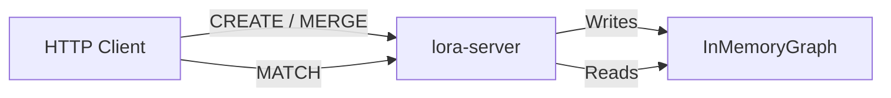

# Ingestion and Pipelines

## How data enters the graph

Most user-facing ingestion flows through **writing Cypher statements (`CREATE`,
`MERGE`, `SET`, …) via `Database::execute` / `execute_with_params`**. What
varies is the surface the caller reaches it through:

- **HTTP** — `POST /query` on `lora-server`
- **Direct Rust** — depend on the `lora-database` crate and call `Database` directly
- **C ABI** — `lora-ffi` exposes the same `Database` pipeline through a C-compatible surface (used by `lora-go`)
- **Language bindings** — `lora-node`, `lora-wasm`, `lora-python`, `lora-go`, `lora-ruby` each wrap the same `Database` calls

The Rust `Database<InMemoryGraph>` also exposes a direct graph API
(`create_node`, `create_relationship`, property/label mutation, delete, and
detach delete) for embedded callers that intentionally bypass Cypher. Those
methods use the same storage mutation primitives and recorder events.

Row files (JSONL, JSON array, CSV) can be imported and query results exported
through `lora-io` and the `Database` import/export driver; see
[Row import and export](#row-import-and-export).

There are no:
- ETL pipelines
- External streaming ingestion service
- Database migration scripts
- Seed scripts outside the test suite (see [Batch seeding](#batch-seeding))

## HTTP ingestion flow

```
Client -> POST /query {"query": "CREATE ...", "params": {...}} -> lora-server -> Database::execute_with_params -> InMemoryGraph
```

The same `Database::execute` / `execute_with_params` entry points handle writes from every other surface listed above.

Every primitive write (`create_node`, `create_relationship`, property set/remove,
label add/remove, delete, detach delete, clear) maps to a `GraphStorageMut`
method, and each method fires a `MutationEvent` at the store's optional
`MutationRecorder`. A single Cypher statement may produce many primitive
mutations. The recorder is `None` by default — no event is constructed, so the
hot path is a single null-pointer check. The shipping consumer of the recorder is
the WAL; install your own via `InMemoryGraph::set_mutation_recorder` for audit
streams, change-data-capture, or replication. See
[../operations/snapshots.md#mutation-events](../operations/snapshots.md#mutation-events)
for the recorder contract and variant list, and [../operations/wal.md](../operations/wal.md)
for how the WAL drives it.

### Creating nodes

```bash
curl -s localhost:4747/query \
  -H 'Content-Type: application/json' \
  -d '{"query": "CREATE (n:User {name: $name, age: $age}) RETURN n", "params": {"name": "Alice", "age": 32}}'
```

### Creating relationships

Relationships require both endpoint nodes to exist. The typical pattern is to first `MATCH` existing nodes, then `CREATE` the relationship:

```bash
curl -s localhost:4747/query \
  -H 'Content-Type: application/json' \
  -d '{"query": "MATCH (a:User {name: $from}), (b:User {name: $to}) CREATE (a)-[:FOLLOWS {since: $since}]->(b) RETURN a, b", "params": {"from": "Alice", "to": "Bob", "since": 2024}}'
```

### Batch seeding

Seed helpers for the test suite live in `crates/lora-database/tests/seeds.rs` (social, org, transport, knowledge, and other fixtures) and are invoked via `TestDb::seed_*` helpers. These run at the Rust API layer; there is no HTTP seed script.

Seeding order matters when creating relationships: the `MATCH` clauses must find the endpoint nodes, so create them first.

### MERGE for idempotent ingestion

`MERGE` can be used for upsert-like behavior:

```cypher
MERGE (n:User {id: 1001}) RETURN n
MERGE (n:User {id: 1002}) ON MATCH SET n.name = 'updated' ON CREATE SET n:New RETURN n
```

## Row import and export

Two layers:

- **`crates/lora-io`** — row-level codecs, independent of the engine. Encoders
  (`JsonlEncoder`, `JsonArrayEncoder`, `CsvEncoder`) stream rows to any
  `std::io::Write`; decoders (`JsonlDecoder`, `JsonArrayDecoder`,
  `CsvDecoder`) parse bytes back into flat `(name, LoraValue)` records.
  `Format` picks the codec. `RowMapping` (`src/mapping.rs`) describes how
  rows become graph data: `RowMapping::Node` (a label, an optional id column,
  column-to-property specs) or `RowMapping::Relationship` (match two existing
  nodes by key and create a typed relationship). `RowMapping::to_cypher()`
  renders it as an `UNWIND $rows AS r CREATE …` template.
- **`crates/lora-database/src/io.rs`** — the driver on `Database`:
  - `import_rows(reader, format, &mapping, batch_size)` renders the mapping
    to a template and calls `import_with_template`.
  - `import_with_template(reader, format, template, batch_size)` decodes rows
    and executes the caller's Cypher once per batch with `$rows` bound to the
    batch (default `DEFAULT_IMPORT_BATCH_SIZE` = 1,000). Each batch is its own
    auto-committed statement, so a failure mid-file leaves earlier batches
    applied. The header is read first, so format errors surface before any
    write.
  - `export_query(query, params, format, writer)` runs the query, materialises
    the result as `RowArrays`, and encodes it. On `Database<InMemoryGraph>`,
    `export_query_streaming` pulls rows off `stream_with_params` instead, so
    memory stays bounded by the encoder buffer.

Both return row counts (`ImportStats { rows, batches }`, `ExportStats { rows }`).
Imports go through the normal Cypher write path, so they produce the same
`MutationEvent`s and WAL records as any other write. The WASM binding exposes
this as `importRows`, `importRowsWithCypher`, and `exportRows` (used by the
playground's import dialog).

## Data lineage

All data originates from Cypher statements: submitted by clients, or generated
by the import driver from row files.


```mermaid
graph LR
    Client[HTTP Client] -->|CREATE / MERGE| Server[lora-server]
    Server -->|Writes| Graph[InMemoryGraph]
    Client -->|MATCH| Server
    Server -->|Reads| Graph
```

## Considerations for future ingestion work

### Persistence (snapshots and WAL)

LoraDB ships two persistence primitives:

1. **Point-in-time snapshots** — `Database::save_snapshot_to` /
   `load_snapshot_from` / `in_memory_from_snapshot` persist and
   restore the full in-memory graph to a single file. On-disk
   format, atomic-write protocol, compression/encryption options, and admin
   surface are documented in [../operations/snapshots.md](../operations/snapshots.md).
   The codec lives in `crates/lora-snapshot`; the storage payload bridge lives in
   `crates/lora-store/src/snapshot.rs`.

2. **Write-ahead log** —
   `Database::open_with_wal` / `Database::recover` /
   `Database::checkpoint_to`, plus managed snapshot and named database
   constructors. The WAL appends committed `MutationEvent` batches to segment
   files and replays committed transactions on boot. Rust and `lora-server`
   expose the full operator surface; Node, Python, Go, and Ruby expose
   filesystem-backed WAL opens; WASM remains snapshot-only. See
   the [website WAL page](../../apps/loradb.com/docs/wal.md) for the
   operator-facing reference, [../operations/wal.md](../operations/wal.md) for
   internals, and [../decisions/0004-wal.md](../decisions/0004-wal.md) for the
   design.
